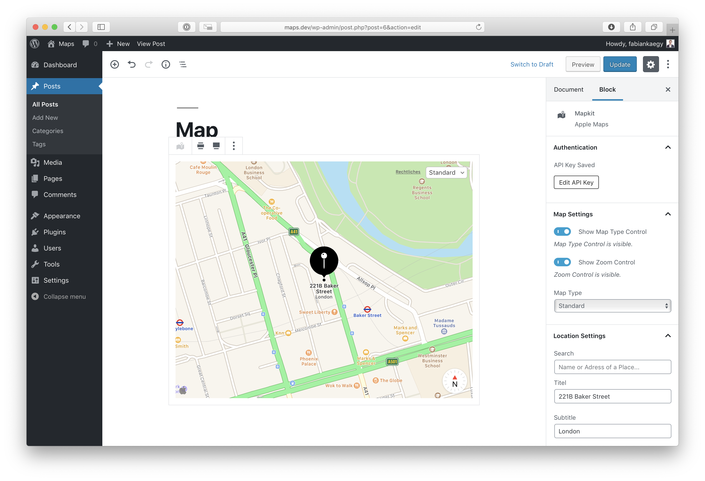

# Apple Maps - Gutenberg Block

## Available Settings

### Toolbar

- **Wide Alignement**: Toggle Button to enable the wide alignement of the block 1
- **Full Alignement**: Toggle Button to enable the full alignement of the block 1

> 1 (only one of these can be active at once)

### Sidebar

#### Authentication

- **Private Key**: Textarea to enter the Private Key provided by Apple
- **Key ID**: Textfield to enter the Key Id provided by Apple
- **Team ID**: Textfield to enter the Team Id provided by Apple

#### Map Settings

- **Show Map Type Control**: Toggle to decide wether or not to show the map type picker on the frontend.
- **Show Zoom Controll**: Toggle to decide wether or not to show the zoom controlls on devices that don't support gestures.
- **Map Type**: Dropdown menu to select the type of Map `[Standard | Muted Standard | Hybrid | Sattelite]`

#### Location Settings

- **Search**: Textfield that searches for places
- **Title**: Textfield that changes the text underneadt the pin on the Map
- **Subtitle**: Textfield that changes the subtitle text underneath the pin on the Map
- **Glyph Text**: Textfield that changes the Text displayed inside the Pin on the Map `[String | Empty]`
- **Glyph Color**: Colorpicker to set the color of the Pin on the Map.

#### Advanced Settings

- **Latitude**: Textfield to manually set the Latitude 
- **Longitude**: Textfield to manually set the Longitude 
